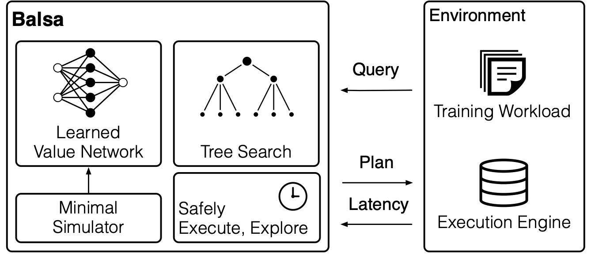
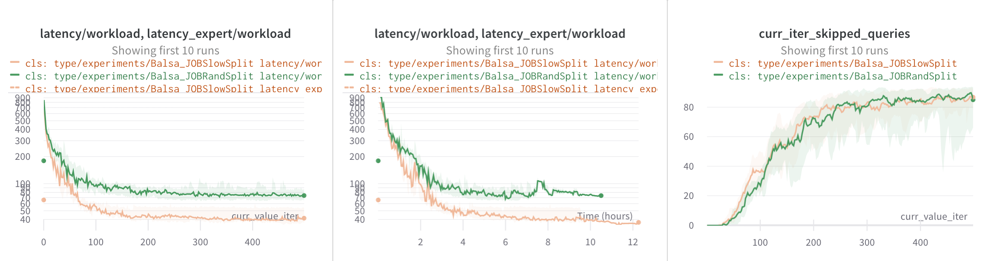

# Balsa

<p>
    <a href="http://arxiv.org/abs/2201.01441">
        
    </a>
    <a href="https://github.com/balsa-project/balsa/blob/master/LICENSE">
        
    </a>
</p>

**Balsa is a learned query optimizer**. It learns to optimize SQL queries by trial-and-error using deep reinforcement learning and sim-to-real learning.

Notably, Balsa is the first end-to-end learned optimizer that does not rely on learning from an existing expert optimizer's plans, while being able to surpass the performance of expert plans, sometimes by a sizable margin.

<p align="center">
    
<p>

For technical details, see the SIGMOD 2022 paper, [Balsa: Learning a Query Optimizer Without Expert Demonstrations](https://zongheng.me/pubs/balsa-sigmod2022.pdf) [[bibtex](#citation)].

[**Setup**](#setup)
| [**Quickstart**](#quickstart)
| [**Experiment configs**](#experiment-configs)
| [**Metrics and artifacts**](#metrics-and-artifacts)
| [**Cluster mode**](#cluster-mode)
| [**Q&A**](#qa)
| [**Citation**](#citation)

## Setup

To quickly get started, run the following on one machine which will run both
the agent neural network and query execution.

1. Clone and install Balsa.

   <details>
   <summary>Details</summary>

    <br>

    ```bash
    git clone https://github.com/balsa-project/balsa.git ~/balsa
   cd ~/balsa
   # Recommended: run inside a Conda environment.
   # All commands that follow are run under this conda env.
   conda create -n balsa python=3.7 -y
   conda activate balsa

   pip install -r requirements.txt
   pip install -e .
   pip install -e pg_executor
    ```
   </details>


2. Install Postgres v12.5.

   <details>
   <summary>Details</summary>

    <br>This can be done in several ways.  For example, installing from source:

    ```bash
    cd ~/
    wget https://ftp.postgresql.org/pub/source/v12.5/postgresql-12.5.tar.gz
    tar xzvf postgresql-12.5.tar.gz
    cd postgresql-12.5
    ./configure --prefix=/data/postgresql-12.5 --without-readline
    sudo make -j
    sudo make install

    echo 'export PATH=/data/postgresql-12.5/bin:$PATH' >> ~/.bashrc
    source ~/.bashrc
    ```
   </details>

3. Install the [`pg_hint_plan`](https://github.com/ossc-db/pg_hint_plan) extension v1.3.7.

   <details>
   <summary>Details</summary>
    <br>

    ```bash
    cd ~/
    git clone https://github.com/ossc-db/pg_hint_plan.git -b REL12_1_3_7
    cd pg_hint_plan
    # Modify Makefile: change line
    #   PG_CONFIG = pg_config
    # to
    #   PG_CONFIG = /data/postgresql-12.5/bin/pg_config
    vim Makefile
    make
    sudo make install
    ```
   </details>


4. Load data into Postgres & start it with the correct [configuration](./conf/balsa-postgresql.conf).

   <details>
   <summary>Details</summary>
    <br>
    For example, load the Join Order Benchmark (JOB) tables:

    ```bash
    cd ~/
    mkdir -p datasets/job && pushd datasets/job
    wget -c http://homepages.cwi.nl/~boncz/job/imdb.tgz && tar -xvzf imdb.tgz && popd
    # Prepend headers to CSV files
    python3 ~/balsa/scripts/prepend_imdb_headers.py

    # Create and start the DB
    pg_ctl -D ~/imdb initdb

    # Copy custom PostgreSQL configuration.
    cp ~/balsa/conf/balsa-postgresql.conf ~/imdb/postgresql.conf

    # Start the server
    pg_ctl -D ~/imdb start -l logfile

    # Load data + run analyze (can take several minutes)
    cd ~/balsa
    bash load-postgres/load_job_postgres.sh ~/datasets/job
    ```

    Perform basic checks:
    ```sql
    psql imdbload
    # Check that both primary and foreign key indexes are built:
    imdbload=# \d title
    [...]

    # Check that data count is correct:
    imdbload=# select count(*) from title;
      count
    ---------
    2528312
    (1 row)
    ```
   </details>

**NOTE**: Using one machine is only for quickly trying out Balsa. To cleanly reproduce results, use [**Cluster mode**](#cluster-mode) which automates the above setup on a cloud and separates the training machine from the query execution machines.

## Quickstart
**First, run the baseline PostgreSQL plans** (the expert) on the Join Order Benchmark:
```bash
python run.py --run Baseline --local
```
This will prompt you to log into [Weights & Biases](https://wandb.ai/home) to track experiments and visualize metrics easily, which we highly recommend. (You can disable it by prepending the env var `WANDB_MODE=disabled` or `offline`).

The first run may take a while due to warming up.  After finishing, you can see messages like:
```
latency_expert/workload (seconds): 156.62 (113 queries)
...
wandb: latency_expert/workload 156.61727
```

**Next, to launch a Balsa experiment:**
```bash
python run.py --run Balsa_JOBRandSplit --local
```
The first time this is run, _simulation data is collected_ for all training queures, which will finish in ~5 minutes (cached for future runs):
```
...
I0323 04:15:48.212239 140382943663744 sim.py:738] Collection done, stats:
I0323 04:15:48.212319 140382943663744 sim.py:742]   num_queries=94 num_collected_queries=77 num_points=516379 latency_s=309.3
I0323 04:16:39.296590 140382943663744 sim.py:666] Saved simulation data (len 516379) to: data/sim-data-88bd801a.pkl
```
Balsa's simulation-to-reality approach requires first training an agent in simulation, then in real execution.  To speed up the simulation phase, we have provided pretrained checkpoints for the simulation agent:
```
...
I0323 04:18:26.856739 140382943663744 sim.py:985] Loaded pretrained checkpoint: checkpoints/sim-MinCardCost-rand52split-680secs.ckpt
```
Then, the agent will start the first iteration of real-execution learning: planning all training queries, sending them off for execution, and waiting for these plans to finish. Periodically, test queries are planned and executed for logging.

Handy commands:
- To kill the experiment(s): `pkill -f run.py`
- To monitor a machine: `dstat -mcdn`

## Experiment configs

All experiments and their hyperparameters are declared in [**`experiments.py`**](./experiments.py).
To run an experiment with the local Postgres execution engine:
```bash
# <name> is a config registered in experiments.py.
python run.py --run <name> --local
```

Main Balsa agent:

| Benchmark             | Config                            |
|-----------------------|-----------------------------------|
| JOB (Random Split)    | `Balsa_JOBRandSplit` |
| JOB Slow (Slow Split) | `Balsa_JOBSlowSplit`        |


Ablation: impact of the simulator (Figure 10):

| Variant    | Config                                         |
|------------|------------------------------------------------|
| Balsa Sim  | (main agent) `Balsa_JOBRandSplit` |
| Expert Sim | `JOBRandSplit_PostgresSim`     |
| No Sim     | `JOBRandSplit_NoSim`        |

> **_NOTE:_**  Running `JOBRandSplit_PostgresSim` for the first time will be slow (1.1 hours) due to simulation data being collected from `EXPLAIN`. This data is cached in `data/` for future runs.

Ablation: impact of the timeout mechanism  (Figure 11):

| Variant                | Config                                          |
|------------------------|-------------------------------------------------|
| Balsa (safe execution) | (main agent)  `Balsa_JOBRandSplit` |
| no timeout             | `JOBRandSplit_NoTimeout`     |


Ablation: impact of exploration schemes (Figure 12):

| Variant                  | Config                                            |
|--------------------------|---------------------------------------------------|
| Balsa (safe exploration) | (main agent)  `Balsa_JOBRandSplit`   |
| epsilon-greedy           | `JOBRandSplit_EpsGreedy` |
| no exploration           | `JOBRandSplit_NoExplore`        |


Ablation: impact of training schemes (Figure 13):

| Variant           | Config                                          |
|-------------------|-------------------------------------------------|
| Balsa (on-policy) | (main agent)  `Balsa_JOBRandSplit` |
| retrain           | `JOBRandSplit_RetrainScheme`    |


Comparision with learning from expert demonstrations (Neo-impl) (Figure 15):

| Variant           | Config                                          |
|-------------------|-------------------------------------------------|
| Balsa  | (main agent)  `Balsa_JOBRandSplit` |
| Neo-impl           | `NeoImpl_JOBRandSplit`    |


Diversified experiences (Figure 16):

| Variant           | Config                                          |
|-------------------|-------------------------------------------------|
| Balsa   |  (Main agents) JOB `Balsa_JOBRandSplit`; JOB Slow `Balsa_JOBSlowSplit` |
| Balsa-8x (uses 8 main agents' data)        | JOB `Balsa_JOBRandSplitReplay`; JOB Slow `Balsa_JOBSlowSplitReplay` |

Generalizing to highly distinct join templates, Ext-JOB (Figure 17):

| Variant           | Config                                          |
|-------------------|-------------------------------------------------|
| Balsa, data collection agent   |  `Balsa_TrainJOB_TestExtJOB` |
| Balsa-1x (uses 1 base agent's data)        |  `Balsa1x_TrainJOB_TestExtJOB`    |
| Balsa-8x (uses 8 base agents' data)        |  `Balsa8x_TrainJOB_TestExtJOB`    |

> **_NOTE:_**  When running a Ext-JOB config for the first time, you may see the error `Missing nodes in init_experience`. This means `data/initial_policy_data.pkl` contains the expert latencies of all 113 JOB queries for printing (assuming you ran the previous configs first) but lacks the new Ext-JOB queries.  To fix, rename the previous `.pkl` file and rerun the new Ext-JOB config, which will automatically run the expert plans of the new query set to regenerate this file (as well as gathering the simulation data).

To specify a new experiment, subclass an existing config (give the subclass a descriptive name), change the values of some hyperparameters, and register the new subclass.

## Metrics and artifacts
Each run's metrics and artifacts are logged to **its log dir** (path of the form `./wandb/run-20220323_051830-1dq64dx5/`), managed by [W&B](https://wandb.ai/home). We recommend creating an account and running `wandb login`, so that these are automatically logged to their UI for visualization.

### Key metrics to look at
  - Expert performance
    - `latency_expert/workload`: total time of expert (PosgreSQL optimizer) plans on training queries, in seconds
    - `latency_expert_test/workload`: for test queries
  - Agent performance
    - `latency/workload`: total time of Balsa's plans on training queries, in seconds
    - `latency_test/workload`: for test queries
  - Agent progress
    - `curr_value_iter`: which iteration the agent is in
    - `num_query_execs`: total number of unique query plans executed, for training queries
    - `curr_iter_skipped_queries`: for the current iteration, number of training plans executed before and thus cached
    - Wallclock duration is an x-axis choice in W&B: `Relative Time (Wall)`
    - `curr_timeout`: current iteration's timeout in seconds for any training plan; for Balsa's safe execution
  - Learning efficiency: plot `latency/workload` vs. wallclock duration
  - Data efficiency: plot `latency/workload` vs. `num_query_execs`

Other (and less important) metrics are also available, such as `latency(_expert)(_test)/q<query number>` for per-query latencies.
    
Example visualization grouping by config `cls`:
<p align="center">
    
<p>


### Artifacts

Tracking metrics is sufficient for running and monitoring experiments.  For advanced use cases, we provide a few artifacts (saved locally and automatically uploaded to W&B).

**Agent checkpoints / the experience buffer so far** are periodically (every 5 iters) saved to:
```
Saved iter=124 checkpoint to: <Balsa dir>/wandb/run-20220323_051830-1dq64dx5/files/checkpoint.pt
Saved Experience to: <Balsa dir>/data/replay-Balsa_JOBSlowSplit-9409execs-11844nodes-37s-124iters-1dq64dx5.pkl
```
The experience buffers are useful for [training on diversified experiences](#qa) (see paper for details).

**Best training plans so far**: under `<logdir>/files/best_plans/`
- `*.sql`: a hinted-version of each training query, where the hint is the best plan found so far; this can be piped into `psql` for re-execution
  - `all.sql`: concatenates all hinted training queries
- `latencies.txt`: best latency so far of training queries; the last row, "all", sums up all training queires

This means **Balsa can be used to find the best possible plans for a set of high-value queries**.

**Hyperparameters of each run**: `<logdir>/files/params.txt`.  Hparams are also (1) printed out at the beginning of each run; and (2) captured in W&B's Config table.  Typically, referring to each hparam config by its class name, such as `Balsa_JOBSlowSplit`, is sufficient, but if any change is made in `run.py#Main()`, the above would capture it.

## Cluster mode
We recommend launching a multi-node Postgres cluster to support multiple agent runs in parallel.
This is optional, but highly recommended: Agent runs can have some variance and thus it's valuable to measure the median and variance of agent performance across several runs of the same config.

Instructions below use [Ray](https://ray.io/) to launch a cluster on AWS; refer to the [Ray documentation](https://docs.ray.io/en/latest/cluster/cloud.html) for credentials setup. See the same docs for launching on other clouds or an on-premise cluster.

> **_NOTE:_**  The AWS instance types used below may not have exactly the same performance as the Azure cluster reported in our paper. The overall magnitude/trends, however, should be the same. See [Cluster hardware used in paper](#cluster-hardware-used-in-paper).

### Launching a cluster
Launch the cluster from your local machine and Ray will handle installing all necessary dependencies and configuring both the GPU driver node (cluster head) and the Postgres execution nodes (cluster workers).

On your laptop, edit the cluster configuration file such that the number of nodes and file mounts are correctly configured; see all `NOTE` comments. By default it uses a `g4dn.12xlarge` head node (48 vCPUs, 192GB RAM, 4 T4 GPUs) and 20 `r5a.2xlarge` worker nodes (8 vCPUs, 64GB RAM, 256GB SSD per node).
```bash
cd ~/balsa
vim balsa/cluster/cluster.yml
```

Start the cluster.
```bash
ray up balsa/cluster/cluster.yml
```

Log in to the head node.
```bash
ray attach balsa/cluster/cluster.yml
```

On the head node, check if the workers are ready. It can take 10-20 minutes while the workers are getting set up.
```bash
# Run this on the head node
conda activate balsa
cd ~/balsa/balsa/cluster/
python check_cluster.py
```
> **_NOTE:_**  To monitor the detailed status of worker launching and setup, run on your laptop: `ray exec cluster.yml 'tail -n 100 -f /tmp/ray/session_latest/logs/monitor*'`.

Before warming up the Postgres worker nodes, you'd need to log onto AWS to add one rule in the security group.
```
1. Click any worker node's "Instance ID" on AWS EC2 web portal
2. Click "Security"
3. Click the security group "sg-xxxx (ray-autoscaler-<cluster name>)"
4. Click "Edit inbound rules"
5. Add rule -> "All TCP" and "Anywhere-IPv4"
6. Click "Save rules"
```

Warm up the Postgres worker nodes:
```bash
# Run this on the head node
cd ~/balsa/balsa/cluster
python warmup_pg_servers.py
```

### Running experiments on the cluster
Log in to the head node and run:
```bash
ray attach balsa/cluster/cluster.yml
wandb login
```

**Before launching parallel runs**, launch a single run first:
```bash
python run.py --run Baseline
python run.py --run <name>
```
This ensures that the appropriate simulation data is generated and cached and that `data/initial_policy_data.pkl` is correct for the query split. After you've observed it to run successfully to the first iteration of the real-execution stage (`Planning took ...`), safely kill it with `pkill -f run.py`. Then, launch multiple runs:
```bash
# Run this on the head node
# Usage: bash scripts/launch.sh <name> <N>
bash scripts/launch.sh Balsa_JOBRandSplit 8

# To monitor:
#   (1) W&B
#   (2) tail -f Balsa_JOBRandSplit-1.log
```

### Editing code
You can edit Balsa code on your laptop under the working directory path specified under `file_mounts` in the `balsa/cluster/cluster.yml` file. Push updated code to the cluster with the following (this will interrupt ongoing runs):
```bash
ray up balsa/cluster/cluster.yml --restart-only
```
Now you can log in to the head node and launch new experiments with the updated changes.

### Cluster hardware used in paper
For experiments reported in our paper, we ran 8 parallel agent runs on the head node sending queries to 20 Postgres nodes (i.e., 2.5 concurrent queires per agent run). We used Ubuntu 18.04 virtual machines on Azure:
  - head node (training/inference): a `Standard_NV24_Promo` VM
    - 24 vCPUs, 224GB memory, 4 M60 GPUs; each agent run uses 0.5 GPU
  - query execution nodes (the target hardware environment to optimize for): 20 `Standard_E8as_v4` VMs
    - 8 vCPUs, 64GB memory, 128GB SSD (Premium SSD LRS) per VM

This is different from what is included in the cluster template above (AWS). To exactly reproduce, change the cluster template to launch the above or manually use the Azure portal to launch a VMSS.

If your cluster config differs in size or hardware, the numbers obtained may be different and the provided [Postgres config](./conf/balsa-postgresql.conf) may need to be adjusted. The overall trends and magnitudes should be similar.

## Q&A

**How to train a Balsa agent with diversified experiences**

Once you have 8 main agent runs finish, their experience buffers will be saved to, say, `./data/replay-Balsa_JOBRandSplit-*-499iters-*.pkl`.
Then, launch `Balsa_JOBRandSplitReplay` to load all experience buffers that match `replay-Balsa_JOBRandSplit-*` (specified by the glob pattern `p.prev_replay_buffers_glob` in `experiments.py`) to train a Balsa-8x agent.
```bash
python run.py --run Balsa_JOBRandSplitReplay
# Or:
bash scripts/launch.sh Balsa_JOBRandSplitReplay 8
```
If you have more buffers that match the glob pattern, be sure to change `p.prev_replay_buffers_glob` to specify the desired buffers.

We also recommend using one experience buffer as a hold-out validation set by specifying `p.prev_replay_buffers_glob_val` for more stable test performance.
Note that in this case the buffers used for training and validation need to be put in seperate directories and the glob patterns also need to be changed accordingly.

Other diversified experience configs are: `Balsa_JOBSlowSplitReplay`, `Balsa1x_TrainJOB_TestExtJOB`, and `Balsa8x_TrainJOB_TestExtJOB`.

**My experiment failed with a "Hint not respected" error**

This occasionally happens when Postgres fails to respect the query plan hint generated by Balsa. This is a fundamental limitation with the `pg_hint_plan` package. We suggest relaunching new runs to replace the failed runs.


## Citation
```bibtex
@inproceedings{balsa,
  author =       {Yang, Zongheng and Chiang, Wei-Lin and Luan, Sifei and Mittal,
                  Gautam and Luo, Michael and Stoica, Ion},
  title =        {Balsa: Learning a Query Optimizer Without Expert
                  Demonstrations},
  booktitle =    {Proceedings of the 2022 International Conference on Management
                  of Data},
  year =         2022,
  pages =        {931--944},
  doi =          {10.1145/3514221.3517885},
  url =          {https://doi.org/10.1145/3514221.3517885},
  address =      {New York, NY, USA},
  isbn =         9781450392495,
  keywords =     {machine learning for systems, learned query optimization},
  location =     {Philadelphia, PA, USA},
  numpages =     14,
  publisher =    {Association for Computing Machinery},
  series =       {SIGMOD/PODS '22},
}

@misc{balsa_github,
  howpublished = {\url{https://github.com/balsa-project/balsa}},
  title =        "Balsa source code",
  year =         2022,
}
```
